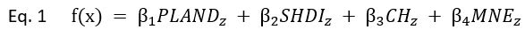
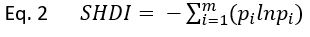
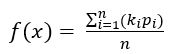
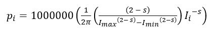
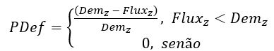
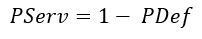
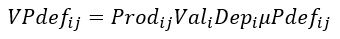

# PolLEM SP - Pollination Landscape Evaluation Model in São Paulo (Modelo de Avaliação da Polinização na Paisagem em São Paulo).
### Autores: Eduardo Freitas Moreira, Luara Tourinho, Rafael Chaves, Danilo Boscolo

O presente documento detalha o funcionamento interno do modelo PolLEM e como foram gerados os dados apresentados na Quarta Nota Técnica do Projeto Biota Síntese, constantes neste repositório.

## Sobre o modelo
O Pollination Landscape Evaluation Model (PolLEM) é um pipeline para a modelagem espacialmente explícita do serviço de polinização prestado a agricultura e valoração deste serviço, desenvolvido pela equipe Agricultura e Serviços Ecossistêmicos do Núcleo de Análise e Síntese de Soluções Baseadas na Natureza (Biota Síntese).
Este modelo foi construído sobre o arcabouço proposto por Metzger e colaboradores (2021) para a inclusão de processos ao nível da paisagem nas avaliações de serviços ecossistêmicos. Esse arcabouço estabelece que os serviços ecossistêmicos sejam modelados a partir da relação espacial entre oferta, fluxo e demanda.
Como base de referência para a v1.0-beta, foi estabelecido o mapa de uso e cobertura do solo do Brasil para o ano de 2022 da Coleção 8 do MapBiomas, com 30m de resolução espacial. Esse mapa de referência foi cortado utilizando como máscara da área de interesse um buffer de 20km a partir dos limites do estado de São Paulo definidos pelo Instituto Brasileiro de Geografia e Estatística (IBGE 2022).

### Oferta de polinizadores
No PolLEM, a oferta é delimitada a partir de um mapa da vegetação nativa. Como definição de vegetação nativa foram incluídas todas as classes do MapBiomas de formação florestal e formação natural não florestal.
Para a área correspondente a vegetação nativa foi calculada a oferta de polinizadores em cada pixel, conforme a seguinte equação (Eq. 1).

Eq. 1	

Onde, *PLAND*z corresponde à proporção de vegetação nativa no entorno do pixel, *SHDI*z corresponde ao índice Shannon de diversidade da paisagem, *CH*z  corresponde à altura máxima do dossel e *MNE*z  corresponde à adequabilidade climática.  Os parâmetros &beta;1, &beta;2, &beta;3, &beta;4 foram definidos conforme a metanálise de Stein e colaboradores (2014).
As variáveis de estrutura da paisagem *PLAND*sub>z  e *SHDI*z foram calculadas para todos os pixels de vegetação nativa sobre o mapa de uso e cobertura do solo do MapBiomas utilizando o método de *Moving Windows*, considerando múltiplos buffers a partir do pixel focal, com os raios 250, 500, 750, 1000, 1500, 2000 e 3000 metros. Foi calculada a média dos buffers e o resultado foi escalonado para amplitude entre zero e um. A proporção de vegetação nativa é igual ao número de pixels dentro do buffer correspondente a vegetação nativa, dividido pelo número total de pixels dento do buffer e foi calculada sobre o mapa binário onde os pixels de vegetação nativa correspondem a um e os demais pixels a zero. Já a diversidade Shannon da paisagem foi calculada de acordo com a seguinte equação (Eq. 2).

Eq. 2		
 
Onde *m* se refere ao número de classes de uso do solo presentes na paisagem e *p*i a proporção da classe i.
*CH* foi obtida a partir de um modelo desenvolvido por Lang e colaboradores (2023) para recuperar dados de altura máxima do dossel a partir de imagens Sentinel-2, com 10m de resolução, treinado com os dados de *light detection and ranging* (LIDAR) da missão *Geolocated Elevation and Height Metrics* (GEDI). Os dados de altura máxima do dossel foram recortados pela mascara da área de interesse, remostados para a resolução de 30m utilizando o grid correspondente aos dados do MapBiomas, usando a média como agregador e, posteriormente os dados foram escalonados para amplitude entre zero e um.
Como estimativa da adequabilidade climática utilizamos modelos de nicho ecológico (*MNE*) baseados no algoritmo de máxima entropia (*Maxent*) para as espécies de abelhas com mais de 1000 registros de ocorrência nas bases do GBIF (*Global Biodiversity Information Facility*) e speciesLink (179 espécies), com os dados bioclimáticos do WorldClim 2.1, com resolução espacial de 30’. A diversidade de polinizadores foi calculada aplicando o índice de diversidade de Shannon sobre os valores preditos de probabilidade de ocorrência segundo o MNE de todas as espécies. Esses dados foram então recortados pela máscara da área de interesse, remostados para a resolução de 30m utilizando o grid correspondente aos dados do MapBiomas, usando o algoritmo de interpolação bicúbica e, posteriormente os dados foram escalonados para amplitude entre zero e um.

###Fluxo de polinizadores
No PolLEM o fluxo de polinizadores consiste na estimativa da quantidade de polinizadores oriundos das áreas de oferta que efetivamente pode alcançar as áreas agrícolas (demanda), dado um modelo de movimento desses organismos na paisagem. 
Para isso, foram realizadas um análises de densidade de kernel, ponderada pelos valores de oferta de polinizadores, utilizando raios de busca ariando de 100 a 2000m em incrementos de 100. Esses mapas de densidade kernel foram combinados através da seguinte equação (Eq. 3).

Eq. 3		

Onde *n* corresponde ao número de escala, *k*i ao valor de densidade kernel para a escala *i* e *p*i ao peso da escala *i*. Por sua vez os pesos das escalas foram definidos pela seguinte equação de decaimento em função da distância (Eq. 4).

Eq. 4		

Onde *s* corresponde ao parâmetro escalonar, *I*i é o valor da escala i em metros, *I*max e *I*min são os valores máximo e mínimo do conjunto de escalas, isto é 100 e 2000m respectivamente.
O valor do fluxo foi restrito as áreas de demanda através da aplicação de máscaras. Essas máscaras foram geradas a partir do mapa de uso do solo do MapBiomas, com a criação de mapas binários para as classes soja, outros cultivos temporários, café, citrus e outros cultivos perenes, onde os pixels correspondentes a essas classes receberam valor um e os demais zero. Além disso, também foi utilizada a combinação dessas classes, como definição da área total de demanda por serviço de polinização. Após a aplicação das máscaras os valores de fluxo foram escalonados para amplitude entre zero e um.

###Demanda dor polinizadores
Demanda dor polinizadores
Para estimativa da demanda de polinizadores das áreas agrícolas foi selecionado o valor máximo da série histórica de NDVI (*Normalized Difference Vegetation Index*) dos produtos de 16 dias (MOD13Q1 e MYD13Q1) da missão MODIS (*Moderate Resolution Imaging Spectroradiometer*), com resolução espacial de 250m, considerando o período entre setembro de 2021 e setembro de 2022. O raster com os valores máximos de NDVI foi remostado para o mesmo grid do MapBiomas com 30m de resolução espacial, utilizando o valor de NDVI no centro do pixel como referência. Em seguida foram aplicadas as máscaras das áreas agrícolas descritas no item anterior, para obtenção do pico de NDVI para os cultivos soja, outros cultivos temporários, café, citrus e outros cultivos perenes, mais a combinação desses para a caracterização da área total de demanda. Para os cultivos de soja, café e citrus os valores do pico máximo de NDVI foram então multiplicados pelo número médio de óvulos das flores de cada cultivo. Por fim, os valores de demanda foram escalonados para amplitude entre zero e um.

###Déficit e serviço de polinização
Para a estimativa dos valores de déficit e serviço de polinização, foram cruzados os valores de fluxo e demanda de polinizadores para cada cultivo conforme as equações Eq. 5 e Eq. 6 respectivamente.

Eq. 5		

Eq. 6		

Onde *PDef* corresponde ao valor do déficit de serviço de polinização, 〖Dem〗_z ao valor de demanda por polinizadores, 〖Flux〗_z ao valor do fluxo de polinizadores para as áreas agrícolas e *PServ* ao serviço de polinização prestado.

###Unidade Hidrográfica de Gerenciamento de Recursos Hídricos (UGRHI)
Foram calculadas as estatísticas descritivas, soma, média e desvio padrão dos valores de déficit e serviço de polinização para as 22 UGRHIs do estado de São Paulo, conforme a delimitação disponível DataGEO do Sistema Ambiental de São Paulo.

###Valoração do déficit e serviço de polinização para a agricultura paulista
Para a estimativa do valor monetário do déficit e serviço de polinização para a agricultura paulista foram utilizados como referência os dados de Produção Agrícola Municipal (PAM) para os cultivos dependentes de polinização no ano de 2022, disponíveis na tabela 5457 do Sistema IBGE de Recuperação Automática (SIDRA). Os valores monetários do déficit e serviço de polinização foram calculados para os cultivos da soja, outros cultivos temporários, café, citrus e outros cultivos perenes conforme as equações Eq. 7 e Eq. 8, respectivamente.

Eq. 7		

Eq. 8		

Onde 〖VPdef〗_ij corresponde ao valor monetário do déficit de serviço de polinização para o cultivo *i* no município *j*, 〖Prod〗_ij a produção do cultivo *i* no município *j*, 〖Val〗_i ao valor monetário da produção do cultivo *i*, 〖Dep〗_i ao nível de dependência de polinizadores do cultivo *i*, 〖μPdef〗_ij a média de déficit de polinização do cultivo *i* no município *j*, 〖VPServ〗_ij ao valor monetário do serviço de polinização do cultivo *i* no município *j* e 〖μPServ〗_ij a média de déficit de polinização do cultivo *i* no município *j*. Os valores de referência para os níveis de dependência de polinização foram definidos conforme a revisão de Siopa e colaboradores (2024). Nos casos das classes outros cultivos temporários e outros cultivos perenes os cálculos foram executados com todos os cultivos contemplados no PAM IBGE, com exceção da soja, café e citrus, e depois os valores dos cultivos pertencentes as respectivas categorias foram somadas.

###Arquivos
Os arquivos de entrada, os produtos intermediários, bem como os resultados finais do POLLEM disponíveis na base de dados estão listados abaixo.

###Camadas raster (GeoTIFF):
1.	Camadas de base
1.1.	Buffer de 20km do limite de São Paulo
1.2.	Área de vegetação nativa (binário, 0 e 1)
1.3.	Área de cultivos dependentes (binário, 0 e 1)
1.4.	Área de cultivo de soja (binário, 0 e 1)
1.5.	Área de cultivo das outras culturas temporárias (binário, 0 e 1)
1.6.	Área de cultivo de café (binário, 0 e 1)
1.7.	Área de cultivo de citrus (binário, 0 e 1)
1.8.	Área de cultivo das outras culturas perenes (binário, 0 e 1)
1.9.	Média da diversidade Shannon da paisagem
1.10.	Média da Proporção de vegetação nativa
1.11.	Altura máxima do dossel
1.12.	Valor máximo de NDVI

2.	Oferta e fluxo de polinizadores
2.1.	Oferta de polinizadores normalizado (intervalo de 0 a 1)
2.2.	Fluxo de polinizadores normalizado (intervalo de 0 a 1)

3.	Demanda de polinizadores:
3.1.	Demanda de polinizadores de todos os cultivos combinados (intervalo de 0 a 1)
3.2.	Demanda de polinizadores da soja normalizada (intervalo de 0 a 1)
3.3.	Demanda de polinizadores de outros cultivos temporários normalizada (intervalo de 0 a 1)
3.4.	Demanda de polinizadores do café normalizada (intervalo de 0 a 1)
3.5.	Demanda de polinizadores de citrus normalizada (intervalo de 0 a 1)
3.6.	Demanda de polinizadores de outros cultivos perenes normalizada (intervalo de 0 a 1)

4.	Serviço de polinização
4.1.	Serviço de polinização para todos os cultivos combinados (intervalo de 0 a 1)
4.2.	Serviço de polinização da soja (intervalo de 0 a 1)
4.3.	Serviço de polinização de outros cultivos temporários (intervalo de 0 a 1)
4.4.	Serviço de polinização do café (intervalo de 0 a 1)
4.5.	Serviço de polinização do citrus (intervalo de 0 a 1)
4.6.	Serviço de polinização de outros cultivos perenes (intervalo de 0 a 1)

5.	Déficit de Serviço de polinização
5.1.	Déficit de Serviço de polinização para todos os cultivos combinados (intervalo de 0 a 1)
5.2.	Déficit de Serviço de polinização da soja (intervalo de 0 a 1)
5.3.	Déficit de Serviço de polinização de outros cultivos temporários (intervalo de 0 a 1)
5.4.	Déficit de Serviço de polinização do café (intervalo de 0 a 1)
5.5.	Déficit de Serviço de polinização do citrus (intervalo de 0 a 1)
5.6.	Déficit de Serviço de polinização de outros cultivos perenes (intervalo de 0 a 1)

Camadas vetoriais (Shapefile)
6.	Unidade Hidrográfica de Gerenciamento de Recursos Hídricos (UGRHI):
6.1.	Soma média e desvio padrão da oferta de polinizadores nas UGRHI do estado de São Paulo
6.2.	Soma média e desvio padrão do serviço e déficit de polinização nas Unidade Hidrográfica de Gerenciamento de Recursos Hídricos (UGRHI) do estado de São Paulo
7.	Valor do serviço de polinização (ano de referência 2022):
7.1.	Valor do serviço e déficit de polinização para os municípios paulistas considerando todos os cultivos dependentes de polinização
7.2.	Valor do serviço e déficit de polinização para os municípios paulistas considerando o cultivo da soja
7.3.	Valor do serviço e déficit de polinização para os municípios paulistas considerando outros cultivos temporários
7.4.	Valor do serviço e déficit de polinização para os municípios paulistas considerando o cultivo do café
7.5.	Valor do serviço e déficit de polinização para os municípios paulistas considerando o cultivo de citrus
7.6.	Valor do serviço e déficit de polinização para os municípios paulistas considerando outros cultivos perenes

###Referências
Metzger, J.P., Villarreal-Rosas, J., Suárez-Castro, A.F., López-Cubillos, S., González-Chaves, A., Runting, R.K., Hohlenwerger, C. and Rhodes, J.R., 2021. Considering landscape-level processes in ecosystem service assessments. Science of The Total Environment, 796, p.149028. https://doi.org/10.1016/j.scitotenv.2021.149028
Lang, N., Jetz, W., Schindler, K. and Wegner, J.D., 2023. A high-resolution canopy height model of the Earth. Nature Ecology & Evolution, 7(11), pp.1778-1789. https://doi.org/10.1038/s41559-023-02206-6
Siopa, C., Carvalheiro, L.G., Castro, H., Loureiro, J. and Castro, S., 2024. Animal‐pollinated crops and cultivars—A quantitative assessment of pollinator dependence values and evaluation of methodological approaches. Journal of Applied Ecology. https://doi.org/10.1111/1365-2664.14634
Stein, A., Gerstner, K. and Kreft, H., 2014. Environmental heterogeneity as a universal driver of species richness across taxa, biomes and spatial scales. Ecology letters, 17(7), pp.866-880. https://doi.org/10.1111/ele.12277
