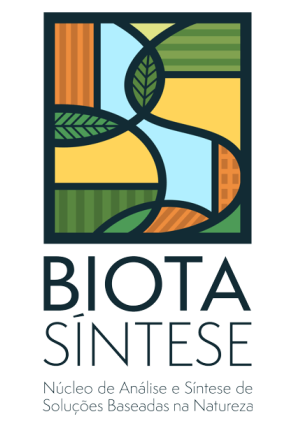

# PolLEM SP - Pollination Landscape Evaluation Model in São Paulo (Modelo de Avaliação da Polinização na Paisagem em São Paulo).
Autores
<code>Eduardo Freitas Moreira&sup1; *, Luara Tourinho&sup1; , Rafael Chaves&sup2; , Danilo Boscolo&sup1;&sup3; </code>

1 - Instituto de Estudos Avançados, Universidade de São Paulo;
2 - SEMIL - Secretaria de Meio Ambiente, Infraestrutura e Logística de SP;
3 - Departamento de Biologia da Faculdade de Filosofia Ciências e Letras de Ribeirão, Universidade de São Paulo

*Autor correspondente: efmoreira@usp.br

O objetivo deste repositório é apresentar resultados de um modelo espacialmente explícito da provisão potencial de polinização baseado na estrutura de oferta, fluxo e demanda, proposta por Metzger et al. (2021), bem como valorar esse serviço para a produção agrícola do estado de São Paulo. Esse modelo, desenvolvido no âmbito do programa Biota Síntese, supera muitas das deficiências das abordagens tradicionais ao estimar o fornecimento de polinização. O modelo foi elaborado e aplicado para todo o estado de São Paulo, de forma a possibilitar a identificação de possíveis aderências e desafios para a incorporação e utilização do modelo em políticas públicas paulistas.

## Sobre o modelo
- A descrição do modelo e suas aplicações estão disponível na quarta Nota Técnico-científica do Projeto Biota Síntese (Autores: Eduardo Freitas Moreira, Luara Tourinho, Rafael Chaves, Danilo Boscolo).
- O detalhamento sobre o funcionamento interno deste modelo pode ser encontrado no arquivo Detalhe_Modelo neste repositório.
# 

## Dados incluídos neste repositório:
Todas as camadas abaixo podem ser acessadas através do arquivo [ArquivosBasePOLLEEMv1beta](ArquivosBasePOLLEEMv1beta.rar), disponível neste repositório.
Para acessar as camadas, baixe o arquivo .rar em seu computador e faça a descompactação. Você pode utilizar o descompactador mais conveninete, mas ná sugerimos o [WinRAR](https://www.win-rar.com/).

### Camadas raster (GeoTIFF):
1.	Camadas de base
    - 1.1.	Buffer de 20km do limite de São Paulo
    - 1.2.	Área de vegetação nativa (binário, 0 e 1)
    - 1.3.	Média da diversidade Shannon da paisagem
    - 1.4.	Média da Proporção de vegetação nativa
    - 1.5.	Altura máxima do dossel
    - 1.6.	Valor máximo de NDVI

2.	Oferta e fluxo de polinizadores
    - 2.1.	Oferta de polinizadores normalizado (intervalo de 0 a 1)
    - 2.2.	Fluxo de polinizadores para todos os cultivos normalizado (intervalo de 0 a 1)
    - 2.3.	Fluxo de polinizadores para a soja normalizado (intervalo de 0 a 1)
    - 2.4.	Fluxo de polinizadores para outros cultivos temporários normalizado (intervalo de 0 a 1)
    - 2.5.	Fluxo de polinizadores para o café normalizado (intervalo de 0 a 1)
    - 2.6.	Fluxo de polinizadores para o citrus normalizado (intervalo de 0 a 1)
    - 2.7.	Fluxo de polinizadores para outros cultivos perenes normalizado (intervalo de 0 a 1)

3.	Demanda de polinizadores:
    - 3.1.	Demanda de polinizadores de todos os cultivos combinados (intervalo de 0 a 1)
    - 3.2.	Demanda de polinizadores da soja normalizada (intervalo de 0 a 1)
    - 3.3.	Demanda de polinizadores de outros cultivos temporários normalizada (intervalo de 0 a 1)
    - 3.4.	Demanda de polinizadores do café normalizada (intervalo de 0 a 1)
    - 3.5.	Demanda de polinizadores de citrus normalizada (intervalo de 0 a 1)
    - 3.6.	Demanda de polinizadores de outros cultivos perenes normalizada (intervalo de 0 a 1)

4.	Serviço de polinização
    - 4.1.	Serviço de polinização para todos os cultivos combinados (intervalo de 0 a 1)
    - 4.2.	Serviço de polinização da soja (intervalo de 0 a 1)
    - 4.3.	Serviço de polinização de outros cultivos temporários (intervalo de 0 a 1)
    - 4.4.	Serviço de polinização do café (intervalo de 0 a 1)
    - 4.5.	Serviço de polinização do citrus (intervalo de 0 a 1)
    - 4.6.	Serviço de polinização de outros cultivos perenes (intervalo de 0 a 1)

5.	Déficit de Serviço de polinização
    - 5.1.	Déficit de Serviço de polinização para todos os cultivos combinados (intervalo de 0 a 1)
    - 5.2.	Déficit de Serviço de polinização da soja (intervalo de 0 a 1)
    - 5.3.	Déficit de Serviço de polinização de outros cultivos temporários (intervalo de 0 a 1)
    - 5.4.	Déficit de Serviço de polinização do café (intervalo de 0 a 1)
    - 5.5.	Déficit de Serviço de polinização do citrus (intervalo de 0 a 1)
    - 5.6.	Déficit de Serviço de polinização de outros cultivos perenes (intervalo de 0 a 1)

### Camadas vetoriais (Shapefile)
6.	Unidade Hidrográfica de Gerenciamento de Recursos Hídricos (UGRHI):
    - 6.1.	Soma média e desvio padrão do serviço de polinização nas Unidade Hidrográfica de Gerenciamento de Recursos Hídricos (UGRHI) do estado de São Paulo
    - 6.2.	Soma média e desvio padrão do déficit de serviço de polinização nas Unidade Hidrográfica de Gerenciamento de Recursos Hídricos (UGRHI) do estado de São Paulo

7.	Valor do serviço de polinização (ano de referência 2022):
    - 7.1.	Valor do serviço e déficit de polinização para os municípios paulistas considerando o cultivo da soja
    - 7.2.	Valor do serviço e déficit de polinização para os municípios paulistas considerando outros cultivos temporários
    - 7.3.	Valor do serviço e déficit de polinização para os municípios paulistas considerando o cultivo do café
    - 7.4.	Valor do serviço e déficit de polinização para os municípios paulistas considerando o cultivo de citrus
    - 7.5.	Valor do serviço e déficit de polinização para os municípios paulistas considerando outros cultivos perenes

  
This work is licensed under a [Creative Commons Attribution-NonCommercial-ShareAlike 4.0 International License](http://creativecommons.org/licenses/by-nc-sa/4.0/).
